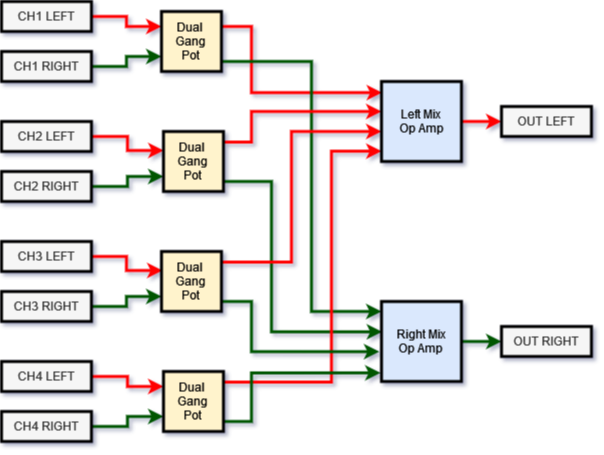

# Tiny 4 Channel Powered Stereo Mixer

A Tiny form-factor 4-channel Stereo Mixer for use with TV/PC/Turntable/Amplifer

## Requirements

1. 4 stereo inputs
2. 1 stereo output
3. Inputs will all use stereo RCA/Phono connectors
4. volume controls for each of the 4 input channels
5. volume controls should be mounted in the front of the case
6. External power input shall be 9V DC
7. Internal power supply shall be +/-9V DC
8. Input signals shall be buffered
9. Volume controls for each channel shall  be independant and not subtract gain from the other channels.
  
## Top level Design

## Power Stage Design

Using [LM2611](https://www.ti.com/lit/ds/symlink/lm2611.pdf)

Reference design from the datasheet

Application curve showing the output current vs the output voltage: For 12V out, the max output current would be 400mA.

The output voltage can be adjusted using the negative feedback resistors RFB1 and RFB2:

|VREF|RFB1|RFB2|VOUT|
|-|-|-|-|
|-1.23v|10K|88.7k|VREF * (1 + (RFB2/RFB1)  = -12.14v|

## Schematics

<object data="doc/design/Tiny4xPoweredStereoMixer.pdf" type="application/pdf" width="700px" height="700px">
    <embed src="doc/design/Tiny4xPoweredStereoMixer.pdf">
        
This browser does not support PDFs. Please download the PDF to view it: <a href="doc/design/Tiny4xPoweredStereoMixer.pdf">Download PDF</a>.

    </embed>
</object>
